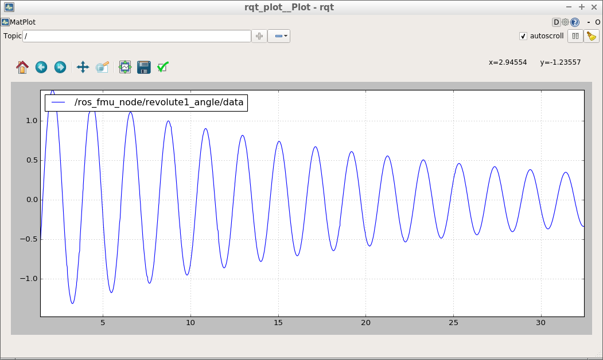

General information about this repository, including legal information, build instructions and known issues/limitations, are given in [README.md](../README.md) in the repository root.

# The fmi_adapter_examples package

This [ROS](http://www.ros.org/) package provides a small example for the use of the fmi_adapter package. It includes a model of a damped pendulum in the [Modelica language](https://www.modelica.org/). In the following, we explain how to create an FMU from this model and how to simulate this model using the fmi_adapter node.

## Creating DampedPendulum.fmu

There are several modeling tools that support the Modelica language and provide FMU export. Examples are [Dymola](http://www.3ds.com/products-services/catia/products/dymola), [JModelica](https://jmodelica.org/), and [OpenModelica](https://www.openmodelica.org/).

In the following, we explain the process by the example of OpenModelica, which has been also used to create the model of the damped pendulum at [share/DampedPendulum.mo](share/DampedPendulum.mo).

*   Download and install OpenModelica for Linux as described in [https://openmodelica.org/download/download-linux](https://openmodelica.org/download/download-linux).
*   Launch `OMEdit` and load the [share/DampedPendulum.mo](share/DampedPendulum.mo) model file.
*   Click on the DampedPendulum model in the project tree on the left.

*   Navigate to Tools -> Options -> FMI and ensure that `Version=2.0`, `Type=Co-Simulation` and `Platforms=Dynamic` is selected.
*   Then click FMI -> Export FMU.
*   The path of the resulting FMU file is shown in the message browser at the bottom of the window, typically `/tmp/OpenModelica_[user]/OMEdit/DampedPendulum.fmu`.

## Simulating DampedPendulum.fmu using the fmi_adapter node

Once the DampedPendulum.fmu file as been created successfully, clone this repository and build it using `catkin build fmi_adapter_examples`. Then, launch the fmi_adapter node and rqt_plot using the provided [damped_pendulum.launch](launch/damped_pendulum.launch) file by:

`roslaunch fmi_adapter_examples damped_pendulum.launch fmu_path:=/[PathTo]/DampedPendulum.fmu`

The fmi_adapter node will load the FMU file and simulate it in real-time. The angle of the pendulum is plotted with rqt_plot:

Please see the [README.md of the fmi_adapter package](../fmi_adapter/README.md) for how to load and run an FMU inside an application-specific ROS node or library.

## Note on bug with mmc_mk_modelica_array in OpenModelica 1.12.0

If the fmi_adapter node crashes with the error message `undefined symbol: mmc_mk_modelica_array`, please patch the files

*   /usr/include/omc/c/meta/meta_modelica.h
*   /usr/include/omc/c/meta/meta_modelica_data.h

according to [https://github.com/OpenModelica/OMCompiler/pull/2397/files](https://github.com/OpenModelica/OMCompiler/pull/2397/files) and export the FMU again.

Details on this bug are given in [https://trac.openmodelica.org/OpenModelica/ticket/4899](https://trac.openmodelica.org/OpenModelica/ticket/4899).
